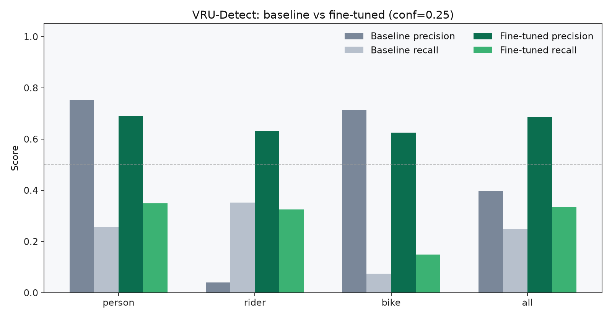
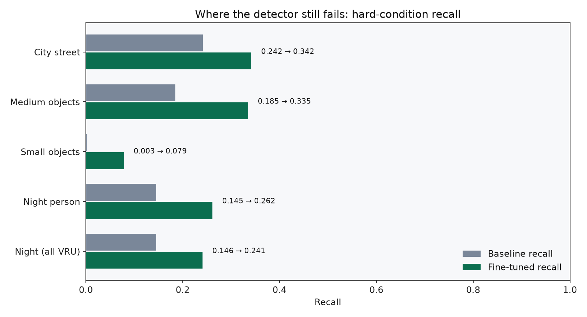
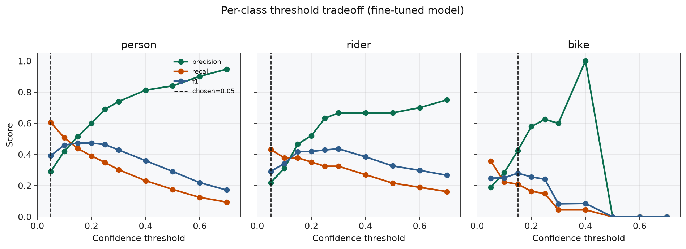

# VRU-Detect

## What this project does

VRU-Detect is a **vulnerable-road-user detection benchmark**.

It answers one concrete question:

> If you take a strong general-purpose object detector and look only at
> pedestrians, riders, and bikes in real road scenes, especially at night or
> when objects are small, where does it fail, and what does task-specific
> fine-tuning plus a deliberate confidence threshold actually buy you?

In practice the repo:

1. pulls a BDD100K road-scene subset,
2. converts labels to YOLO format with lighting/weather/scene/size metadata,
3. measures a COCO-pretrained YOLO26n **baseline**,
4. fine-tunes on VRU-heavy data,
5. re-measures with the same stratified metrics,
6. chooses per-class operating thresholds with an explicit miss-cost story,
7. packages the whole loop so another engineer can reproduce it.

It is **not** a self-driving stack, not a live video product, and not a
safety-certified perception system. It is a portfolio/research case study in
evaluating perception risk honestly.

| | |
| --- | --- |
| **Role** | Portfolio / research benchmark, not a safety-certified system |
| **Stack** | Python, Ultralytics YOLO26n, BDD100K (HF mirror), stratified P/R |
| **Status** | On `main`: Phases 0–5 complete; roadmap for next ceiling raises |
| **Owner** | Nabil Khoury |
| **Contact** | [nabilkhoury.com](https://nabilkhoury.com) · [github.com/nktarasios](https://github.com/nktarasios) · khouryn77@gmail.com |

> If you only skim one thing: fine-tuning improved aggregate precision/recall
> from **0.396 / 0.248 → 0.685 / 0.335**, but night-person and small-object
> recall remain the product-critical gaps. That is the point of the project.



## Why this exists

Off-the-shelf detectors can look fine on aggregate COCO-style metrics while
missing the road users that matter most in urban risk analysis: small,
distant, or poorly lit pedestrians and cyclists.

VRU-Detect turns that failure mode into an auditable workflow:

1. **Normalize** BDD labels into a small VRU taxonomy (`person`, `rider`, `bike`).
2. **Measure** a COCO-pretrained YOLO26n baseline under lighting / weather /
   scene / size strata, not just mean AP.
3. **Fine-tune** on a VRU-preferring local split with oversampling.
4. **Choose operating thresholds** with an explicit miss-vs-false-positive cost story.
5. **Package** the method so another engineer can reproduce the claim.

This is the second of three related projects:
**SGO-Audit → VRU-Detect → Agentic SDLC Toolkit**.

Product scope docs:

- [VRU_PRD.md](VRU_PRD.md): problem, goals/non-goals, success criteria
- [docs/PRODUCT_DECISIONS.md](docs/PRODUCT_DECISIONS.md): why each major call was made
- [docs/SHOWCASE.md](docs/SHOWCASE.md): web showcase / GitHub Pages setup
- [site/](site/): static case-study site (shareable URL via Pages)
- [results/portfolio/FINDINGS.md](results/portfolio/FINDINGS.md): metric readout for reviewers
- [results/portfolio/ERROR_REPORT.md](results/portfolio/ERROR_REPORT.md): where misses still concentrate
- [MODEL_CARD.md](MODEL_CARD.md): intended use, limits, disclaimer
- [VRU_TECHNICAL_IMPLEMENTATION.md](VRU_TECHNICAL_IMPLEMENTATION.md): phased build plan

### Web showcase

```bash
python3 -m http.server 8080 --directory site
```

Then enable GitHub Pages (Settings → Pages → GitHub Actions) for a public URL
like `https://nktarasios.github.io/vru-detect/`. See [docs/SHOWCASE.md](docs/SHOWCASE.md).

## Product instincts on display

| Decision | Instinct | Evidence in repo |
| --- | --- | --- |
| Optimize for VRU risk, not mAP vanity | Safety-relevant slice over generic CV homework | Stratified eval + night/small focus |
| Cut live video and sensor fusion | Scope control; avoid hiding weak evaluation behind demo chrome | Explicit non-goals in PRD |
| Thresholds are product choices | Missed pedestrian ≠ extra false box | Recall-first person/rider thresholds |
| Honest non-result for SGO cross-ref | Do not force a narrative | `results/sgo_crossref/` note |
| Ship code + repro, not restricted weights | License-aware open source | No raw BDD / no committed checkpoints |

## Headline results

Same 300-image validation split, confidence `0.25`:

| class | baseline P / R | fine-tuned P / R | what changed |
| --- | ---: | ---: | --- |
| person | 0.754 / 0.257 | 0.689 / 0.349 | Recall up; slight precision trade |
| rider | 0.039 / 0.351 | 0.632 / 0.324 | Precision collapses false alarms |
| bike | 0.714 / 0.075 | 0.625 / 0.149 | Recall ~2×, still weak |
| all | 0.396 / 0.248 | 0.685 / 0.335 | Aggregate improves; hard cases remain |

### Hard-condition recall (the actual product risk)



| condition | baseline recall | fine-tuned recall | delta |
| --- | ---: | ---: | ---: |
| Night (all VRU) | 0.146 | 0.241 | +0.095 |
| Night person | 0.145 | 0.262 | +0.116 |
| Small objects | 0.003 | 0.079 | +0.076 |
| Medium objects | 0.185 | 0.335 | +0.150 |

**Read:** fine-tuning moves the needle, but a reviewer should still refuse to
treat this as deployment-ready. Small-object recall under 0.10 is an open risk.

### Operating thresholds (cost-aware)



| class | threshold | P / R at choice | rationale |
| --- | ---: | ---: | --- |
| person | 0.05 | 0.291 / 0.605 | Missed person is worse than an extra trigger → recall-first |
| rider | 0.05 | 0.219 / 0.432 | Same miss-cost logic as person |
| bike | 0.15 | 0.424 / 0.209 | Best F1; extreme recall chasing was noisier |

Full writeup: [`results/finetuned/threshold_justification.md`](results/finetuned/threshold_justification.md).

## Technical shape

```text
scripts/download_bdd_hf.py   # Phase 0 data acquisition (HF fallback)
src/dataset.py               # BDD → YOLO + conditions.csv
src/baseline_eval.py         # Phase 1 stratified baseline
src/train.py                 # Phase 2 fine-tune + VRU oversampling
src/evaluate.py              # Phase 3 stratified eval + threshold sweep
src/crossref_sgo.py          # Phase 4 optional SGO alignment check
src/infer_demo.py            # Phase 5 annotated demo export
scripts/build_portfolio_figures.py
```

Design rule: each phase is a standalone module. Partial reproduction is a
feature, someone can rerun baseline eval without training.

### Reference training run

- model: `yolo26n`
- data: 1200 train / 300 val VRU-preferring subsample (HF validation mirror)
- epochs: 10 · device: CPU · oversample ×3 · imgsz/batch for completed run: 640/4
- best val mAP50 ≈ **0.330** (epoch 8)
- weights path used by scripts: `models/vru_best.pt` (**not committed**: reproduce with `python3 -m src.train`)

## Quickstart

Python 3.11 is expected (the metrics in `results/` were produced with it).

One-shot reproduction (download → train → eval → portfolio charts):

```bash
python3 -m venv .venv
source .venv/bin/activate
bash scripts/reproduce.sh
```

Or step-by-step:

```bash
python3 -m pip install -r requirements.txt

python3 scripts/download_bdd_hf.py
python3 -m src.dataset

python3 -m src.baseline_eval --weights yolo26n.pt --conf 0.25 --max-images 300
python3 -m src.train --device auto
python3 -m src.evaluate --weights models/vru_best.pt --device auto

python3 -m src.infer_demo \
  --images data/processed/images/val \
  --weights models/vru_best.pt \
  --output-dir outputs/demo \
  --device auto

python3 scripts/build_portfolio_figures.py
python3 scripts/build_error_report.py
```

Dataset note: official ETH host `dl.cv.ethz.ch` was preferred but DNS failed in
the build environment; the documented path uses Hugging Face
[`dgural/bdd100k`](https://huggingface.co/datasets/dgural/bdd100k). Raw images
are gitignored. See [`scripts/README.md`](scripts/README.md).

## What a strong reviewer should ask next

These are intentional open edges, not surprises:

1. **Scale:** GPU + full official BDD train split should raise absolute metrics.
2. **Small / night:** current residual risk; next levers are resolution, tiling,
   night-heavy sampling, and class-specific augmentation.
3. **SGO cross-ref:** ready when an SGO-Audit export is available; currently an
   honest non-result.
4. **Demo gallery:** run `infer_demo` locally after training to attach annotated
   frames for writeups (outputs are gitignored by license posture).

## Tests

```bash
python3 -m pytest -q
```

## License & disclaimer

- Code: MIT ([LICENSE](LICENSE))
- Dataset / trained-weight redistribution: governed by BDD100K terms, review
  upstream before any commercial use
- **VRU-Detect is not a safety-certified or production perception system.**
  Do not use these metrics or artifacts for deployment, regulatory, or safety
  claims.

---

Built AI-assisted under the staged process documented in [AI-SDLC](https://github.com/nktarasios/AI-SDLC).
